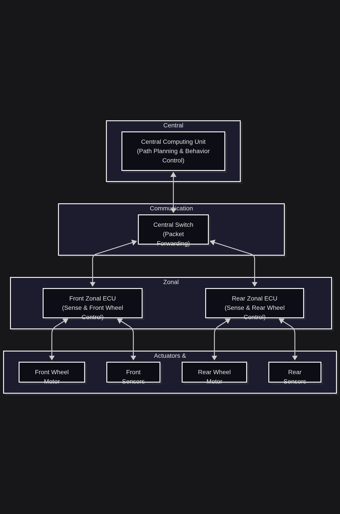
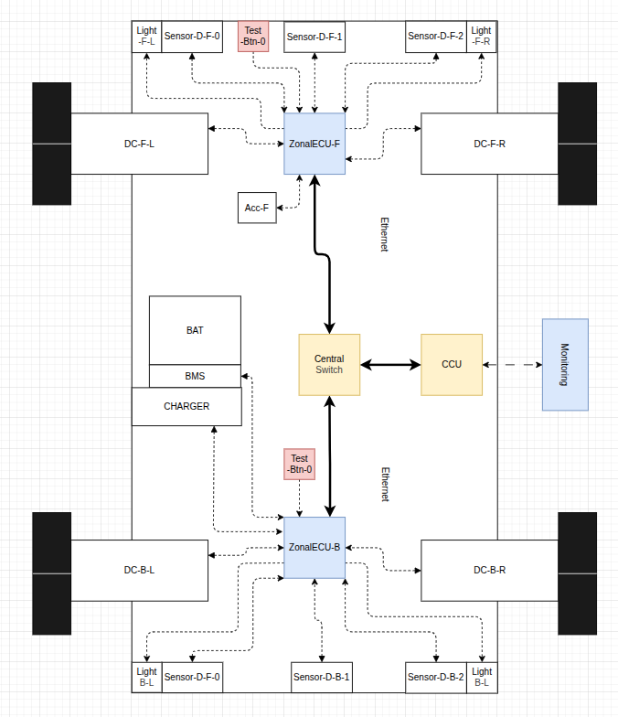

# PRIORITY INFO

This branch for the Front-ZECU 

# About

This is a mini-project implementing a Zonal Architecture on a scale model. The system consists of:
- 02 Zonal ECUs (Front & Rear): Responsible for controlling the two wheels and sensing environmental data.
- 01 Central Switch: Forwards packets between the units.
- 01 Central Computing Unit: Handles path planning and controls the overall behavior of the model.

# System Architecture

The following diagrams illustrate the architecture of the scale model, transitioning from a conceptual logical framework to its practical implementation on the vehicle chassis.

## Communication layers

This hierarchical diagram represents the functional decomposition of the Zonal Architecture. The system is organized into four distinct layers:

- Central Layer: Features the Central Computing Unit (CCU), responsible for high-level tasks such as path planning and behavior control.

- Communication Layer: Utilizes a Central Switch to manage deterministic packet forwarding between the brain and the zones.

- Zonal Layer: Consists of Front and Rear Zonal ECUs that act as local gateways.

- Actuators & Sensors Layer: The hardware interface where raw data is collected and motor commands are executed.



## Physical layout

This diagram provides a hardware-centric view, mapping the logical units onto the actual physical footprint of the model. It highlights the spatial distribution of components, including:

- Power Management: Integration of the Battery (BAT), BMS, and Charging circuitry.

- Ethernet Backbone: The high-speed communication links connecting the CCU, Switch, and Zonal ECUs.

- Peripheral Mapping: Detailed placement of DC motors (DC-F-L, DC-B-R, etc.) and the array of distance sensors (Sensor-D-F-0) distributed around the vehicle body for environment sensing.




# Working directory
```
fus@fus-X409FA ZonalArchECU_W_SomeIP git:(Lab) 
> tree
.
├── AppComm
│   ├── CMakeLists.txt
│   ├── Dummy
│   │   ├── Dummy.c
│   │   └── Dummy.h
│   ├── EthernetW5500
│   │   ├── EthernetW5500.c
│   │   ├── EthernetW5500Cmds.h
│   │   ├── EthernetW5500.h
│   │   ├── Module.c
│   │   └── Module.h
│   ├── HBridge
│   │   ├── HBridge.c
│   │   ├── HBridge.h
│   │   ├── Module.c
│   │   └── Module.h
│   └── UltraSonic
│       └── UltraSonic.c
├── AppConfig
│   ├── All.h
│   ├── CMakeLists.txt
│   ├── Comm
│   │   ├── Comm.c
│   │   ├── Comm.c.def
│   │   ├── Comm.cnf
│   │   ├── Comm.h
│   │   ├── Comm.h.def
│   │   └── Makefile
│   ├── Pinout
│   │   ├── Makefile
│   │   ├── Pinout.cnf
│   │   ├── Pinout.h
│   │   └── Pinout.h.def
│   └── SystemLog.h
├── AppESPWrap
│   ├── All.h
│   ├── AppESPWrap.c
│   ├── CMakeLists.txt
│   ├── ESPFreeRTOSWrapper.h
│   ├── ESPGPIOWrapper.h
│   ├── ESPHeapWrapper.h
│   └── ESPLogWrapper.h
├── AppUtils
│   ├── All.h
│   ├── AppUtils.c
│   ├── Arithmetic.h
│   ├── BitOp.h
│   ├── Bitwise.h
│   ├── CMakeLists.txt
│   ├── FlagControl.h
│   ├── Loop.h
│   └── ReturnType.h
├── CMakeLists.txt
├── Docs
│   ├── draft-system-arch.drawio
│   ├── draft-system-arch-logic.mermaid
│   └── W5500_Startup.mermaid
├── draft-system-arch.drawio
├── main
│   ├── CMakeLists.txt
│   ├── MainApp.c
│   └── MainApp.h
├── PythonTest
│   ├── Broadcast.py
│   └── Req.txt
├── readme.md
├── sdkconfig
└── sdkconfig.old

```

